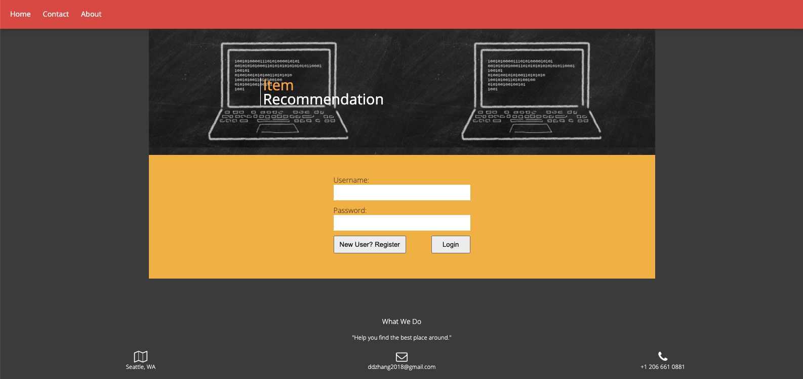
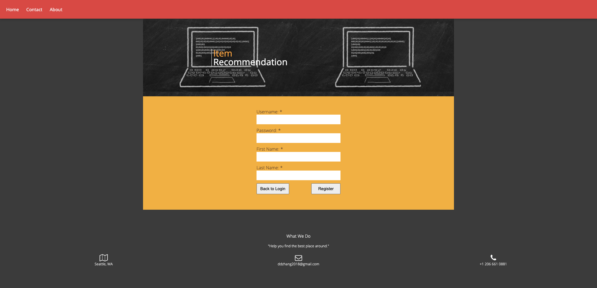
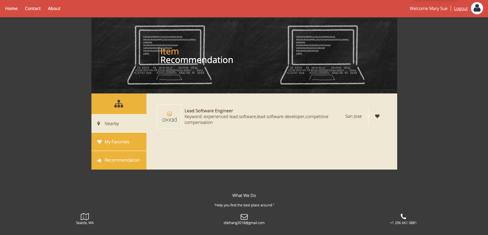
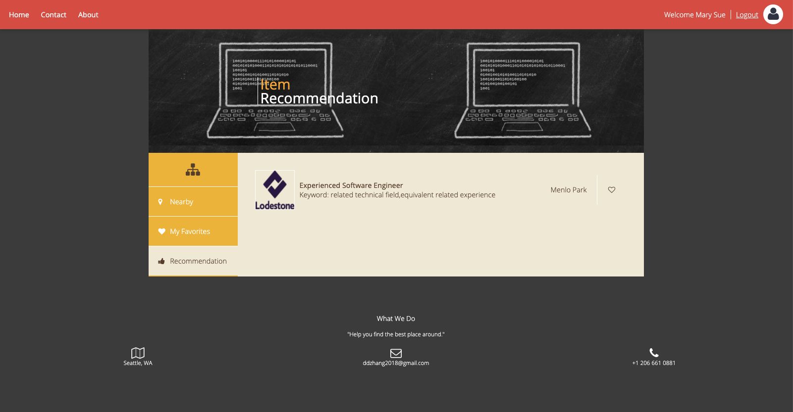
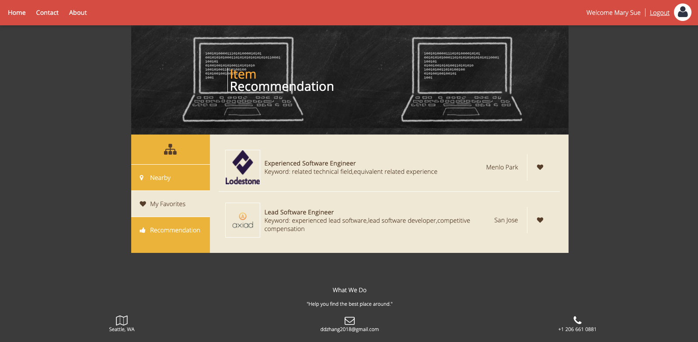

# Job Plus

## Description
Job plus is an AWS(Amazon Web Service) based web application that recommends personalized job positions to users. 

### Front End:
* Developed interactive web page for users to search and favorite positions, and get recommendation of positions based on user's favorite items. 
* HTML, CSS, JavaScript, AJAX

### Back End:
* Builded three Java servlets with RESTful APIs to handle HTTP requests and responses
* Builded MySQL database on Amazon RDS to store data from Github Job API
* Used MonkeyLearn API to extract keywords from description of positions
* Designed algorithms (e.g., content-based recommendation) to implement job recommendation
* Deployed to Amazon EC2 for better performance. 

### Screenshots:
home page / login:

registration:

get nearby positions based on user's geolocation:

get content-based recommendation: 

favorite a position by clicking on the heart icon:

